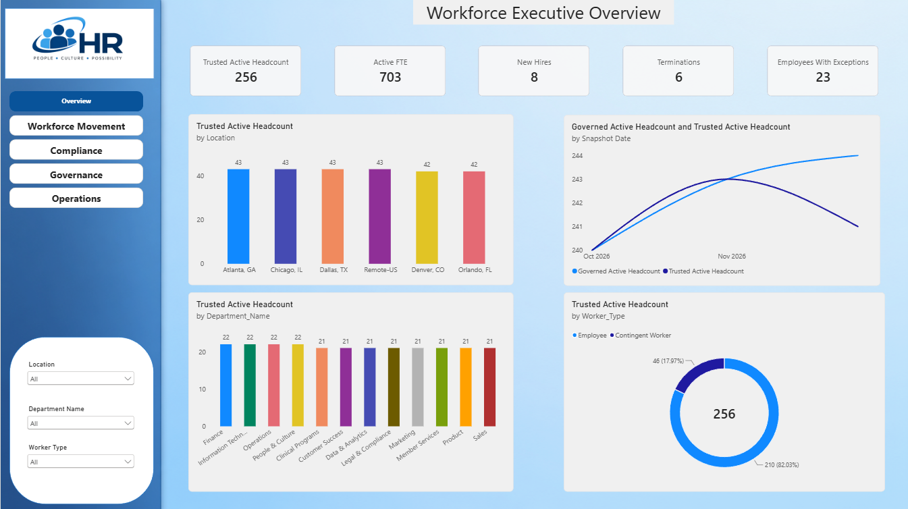
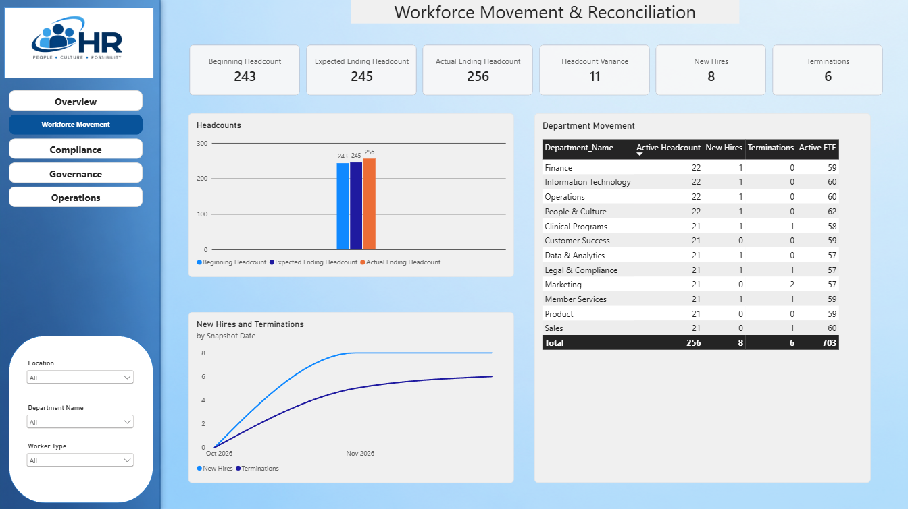
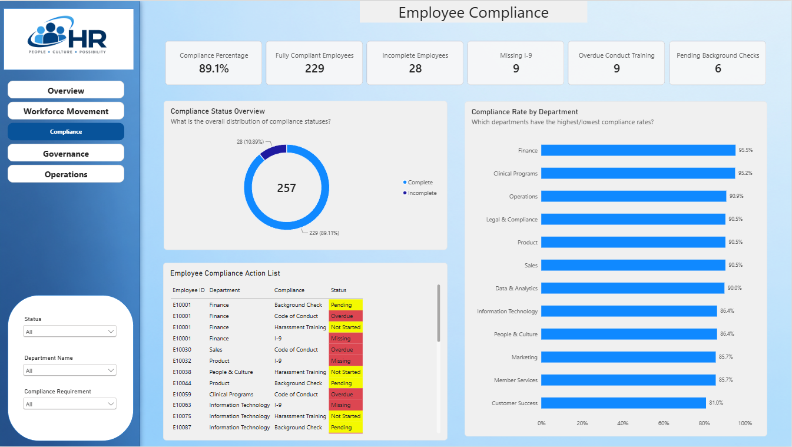
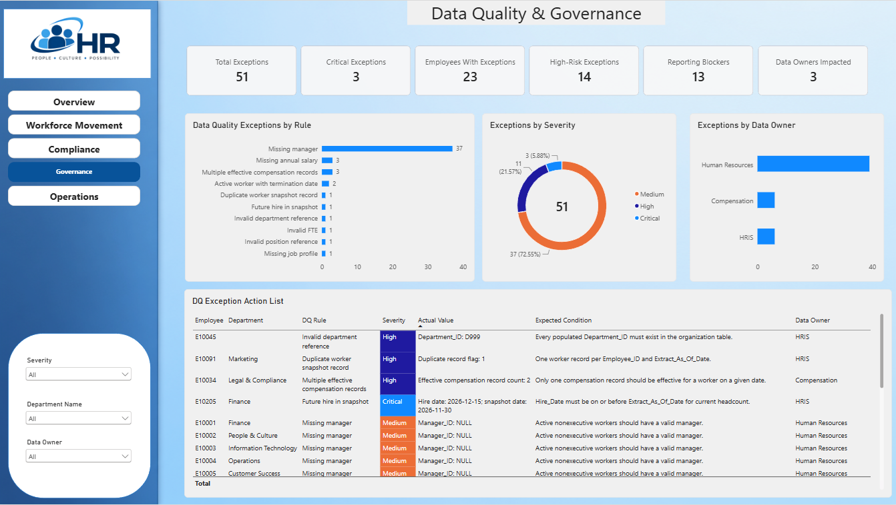
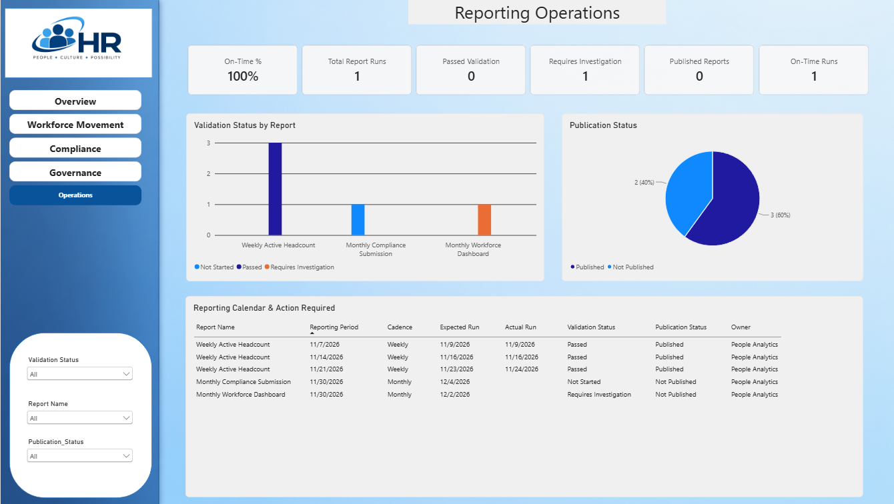

# HR People Analytics, Data Quality & Reporting Operations

## Project Overview

This project is an end-to-end HR / People Analytics solution built to demonstrate how workforce reporting can move beyond dashboard development into data validation, governance, compliance monitoring, and reporting operations.

The project was designed around a question I frequently encounter in analytics work:

> If a number on a dashboard looks wrong, can I trace it back through the data, identify what changed, and explain why?

Rather than starting with Power BI, I approached the project from the data outward.

**SQL → Staging → Governed Data → Data Quality Rules → Reporting → Power BI**

The final Power BI report contains five pages covering the workforce reporting lifecycle:

1. Workforce Executive Overview
2. Workforce Movement & Reconciliation
3. Employee Compliance
4. Data Quality & Governance
5. Reporting Operations

---

## Business Scenario

HR leadership needs reliable workforce reporting for headcount, workforce movement, employee compliance, and operational reporting.

The challenge is that producing a dashboard is only one part of the reporting process.

Before workforce metrics can be trusted, the underlying data must also be:

- validated,
- reconciled,
- governed,
- monitored for data-quality exceptions,
- assigned to appropriate data owners,
- evaluated for reporting impact,
- and tracked through validation and publication.

This project models that broader reporting environment.

---

## Technology Stack

- SQL Server
- SQL / T-SQL
- Power BI
- Power Query
- DAX
- Dimensional data modeling
- Data quality rule framework
- Reporting governance
- Data validation and reconciliation

---

# Power BI Report

## Page 1 — Workforce Executive Overview

The executive overview provides a high-level snapshot of the current workforce.

### Key Metrics

- Trusted Active Headcount
- Active FTE
- New Hires
- Terminations
- Employees With Data Quality Exceptions

### Analysis

The page analyzes workforce distribution across:

- Location
- Department
- Worker Type
- Reporting snapshot

It also compares governed and trusted headcount over time to make discrepancies in workforce reporting visible.

### Business Question

**What does the current workforce look like, and can leadership trust the reported headcount?**

---

## Page 2 — Workforce Movement & Reconciliation

The second page focuses on workforce movement and headcount reconciliation.

### Key Metrics

- Beginning Headcount
- Expected Ending Headcount
- Actual Ending Headcount
- Headcount Variance
- New Hires
- Terminations

The expected ending workforce is reconciled against the actual reported workforce.

Conceptually:

`Beginning Headcount + Hires - Terminations = Expected Ending Headcount`

The expected result can then be compared with actual ending headcount to identify unexplained workforce movement or reporting differences.

### Analysis

The page includes:

- Headcount reconciliation
- New hire and termination trends
- Department-level workforce movement

### Business Question

**Does workforce movement explain the change in reported headcount?**

---

## Page 3 — Employee Compliance

The Compliance page turns HR compliance data into an operational monitoring tool.

### Key Metrics

- Compliance Percentage
- Fully Compliant Employees
- Incomplete Employees
- Missing I-9
- Overdue Conduct Training
- Pending Background Checks

### Compliance Transformation

The source compliance data originally stored requirements across multiple columns.

Power Query was used to unpivot the compliance fields into a reporting-friendly structure:

`Employee → Compliance Requirement → Requirement Status`

This makes individual compliance requirements easier to filter, analyze, and act upon.

### Analysis

The page includes:

- Overall compliance status
- Compliance rate by department
- Employee Compliance Action List

The action list identifies individual requirements requiring attention, including statuses such as:

- Pending
- Overdue
- Not Started
- Missing

### Business Question

**Where does employee compliance risk exist, and what specifically requires action?**

---

## Page 4 — Data Quality & Governance

This page moves beyond reporting metrics and examines whether the underlying workforce data is trustworthy.

A governed data-quality exception framework was created to identify records that violate defined business rules.

### Key Metrics

- Total Data Quality Exceptions
- Critical Exceptions
- Employees With Exceptions
- High-Risk Exceptions
- Reporting Blockers
- Data Owners Impacted

### Data Quality Framework

Each exception contains governance metadata such as:

- Rule ID
- Rule Name
- Rule Description
- Severity
- Employee
- Actual Value
- Expected Condition
- Data Owner
- Resolution Status
- Reporting impact

Rules identify issues such as:

- Missing managers
- Missing annual salary
- Multiple effective compensation records
- Duplicate worker snapshots
- Future hire dates appearing in current snapshots
- Invalid department references
- Invalid FTE
- Invalid position references
- Missing job profiles

### Severity

Exceptions are classified as:

- Critical
- High
- Medium

### Reporting Impact

Data-quality exceptions can also indicate whether an issue should block publication of:

- Workforce reporting
- Compliance reporting
- Compensation reporting

This connects data quality directly to downstream reporting risk.

### Analysis

The page includes:

- Data Quality Exceptions by Rule
- Exceptions by Severity
- Exceptions by Data Owner
- DQ Exception Action List

### Business Question

**Can the workforce data be trusted, what is wrong, how serious is it, and who owns remediation?**

---

## Page 5 — Reporting Operations

The final page monitors what happens after workforce data has been prepared and validated.

It introduces an operational audit layer for scheduled reporting.

### Key Metrics

- On-Time %
- Total Report Runs
- Passed Validation
- Reports Requiring Investigation
- Published Reports
- On-Time Runs

### Reporting Audit

Report execution information includes:

- Report name
- Reporting period
- Expected run date
- Actual run date
- Validation status
- Publication status
- Exception counts
- Reporting row counts
- Analyst
- Validation notes

Validation statuses include:

- Passed
- Requires Investigation
- Not Started

Publication is tracked separately from validation so a report can be validated without automatically being considered published.

### Analysis

The page includes:

- Validation Status by Report
- Publication Status
- Reporting Calendar / Action Required

The reporting calendar tracks recurring reports and provides visibility into expected execution dates, actual runs, validation results, publication status, and ownership.

### Business Question

**Did reporting run when expected, pass validation, and successfully move through publication?**

---

# Data Architecture

The project follows a layered approach rather than connecting Power BI directly to raw source data.

## Raw Layer

Represents source-system data as received.

Examples include:

- Workforce data
- Employee compliance
- Organization structures
- Reporting calendar

## Staging Layer

Used for standardization, transformation, type handling, and preparation before governance rules are applied.

## Governed Layer

Applies business rules and creates trusted reporting structures.

This layer includes the data-quality exception framework used to identify records that violate defined expectations.

## Reporting Layer

Provides reporting-ready structures consumed by Power BI.

This separates dashboard logic from raw source-system complexity and provides clearer lineage from source data to business metric.

---

# Data Quality & Governance Approach

Data quality was treated as part of the analytics solution rather than as a separate cleanup activity.

Each rule defines:

- What is being tested
- What condition is expected
- What was actually found
- Severity
- Data ownership
- Whether the issue affects report publication

This allows an analyst to move from:

**"The dashboard number looks wrong."**

to:

**"Here is the record causing the issue, the business rule it violates, the expected condition, its severity, the responsible data owner, and whether it should prevent reporting."**

---

# Key DAX / Analytical Concepts

The Power BI model includes measures supporting:

- Active Headcount
- Active FTE
- New Hires
- Terminations
- Expected Ending Headcount
- Headcount Variance
- Compliance Percentage
- Fully Compliant Employees
- Data Quality Exception Counts
- Employees With Exceptions
- Critical / High-Risk Exceptions
- Reporting Blockers
- Report Run Counts
- Validation Results
- Published Reports
- On-Time Reporting

Measures were designed to respond to report filter context while maintaining consistent business definitions.

---

# Key Skills Demonstrated

This project demonstrates practical experience with:

### SQL & Data Engineering Concepts
- Layered SQL architecture
- Data transformation
- Data validation
- Reporting views
- Data reconciliation

### Power BI
- Data modeling
- DAX
- Power Query
- KPI development
- Interactive filtering
- Operational dashboards
- Conditional formatting

### Data Quality
- Rule-based validation
- Exception management
- Severity classification
- Root-cause investigation
- Actual vs. expected value analysis

### Data Governance
- Business definitions
- Data ownership
- Reporting controls
- Publication blockers
- Traceability and lineage

### People Analytics
- Headcount
- FTE
- Hires
- Terminations
- Workforce movement
- Employee compliance
- Department analysis

### Reporting Operations
- Reporting calendars
- Validation status
- Publication status
- On-time reporting
- Report execution auditing

---

# What I Learned

One of the biggest lessons from this project was that reliable analytics requires more than creating accurate DAX measures or polished visualizations.

A workforce number can be mathematically correct and still be misleading if:

- the underlying employee record is duplicated,
- organizational references are invalid,
- compensation records overlap,
- compliance data is incomplete,
- business definitions are inconsistent,
- or reporting is published before critical exceptions are resolved.

Building the project end to end reinforced the importance of connecting technical validation with business definitions and operational reporting processes.

The dashboard is the final presentation layer.

Trust in the dashboard begins much earlier in the data lifecycle.

---

# Dashboard Pages

## Workforce Executive Overview

## Workforce Movement & Reconciliation

## Compliance

## Data Quality & Governance

## Reporting Operations

---

## Project Status

**Complete**

The final solution includes the SQL data architecture, governed data-quality framework, reporting logic, Power BI semantic model, DAX measures, compliance transformation, reporting controls, and five-page Power BI report.

---

## 🔐 Data Disclaimer

All data used in this project is entirely synthetic and was created solely for portfolio, learning, and demonstration purposes. No real employee, employer, HRIS, compensation, compliance, or confidential business data is included. Employee records, organizational structures, workforce metrics, data-quality exceptions, and reporting activity are fictional and were designed to simulate realistic People Analytics and HR reporting scenarios.
---

## 👤 Author

**Catherine McKillips**

Business Intelligence / Data Analyst

